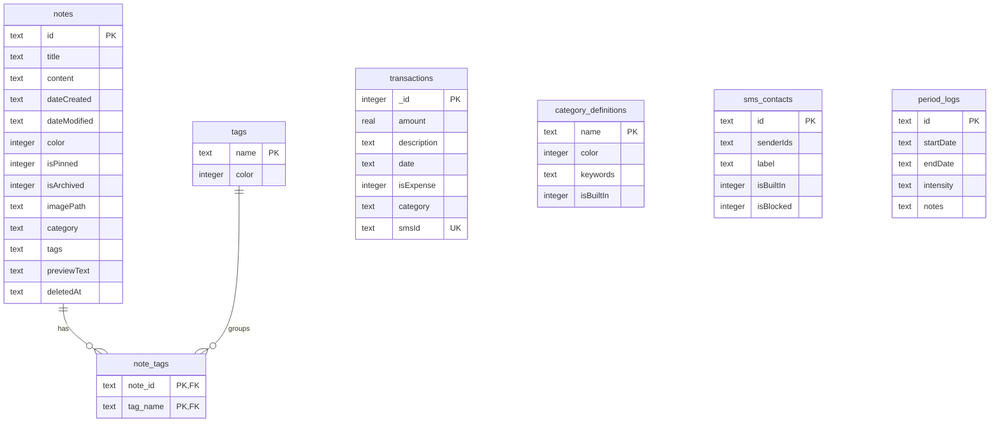
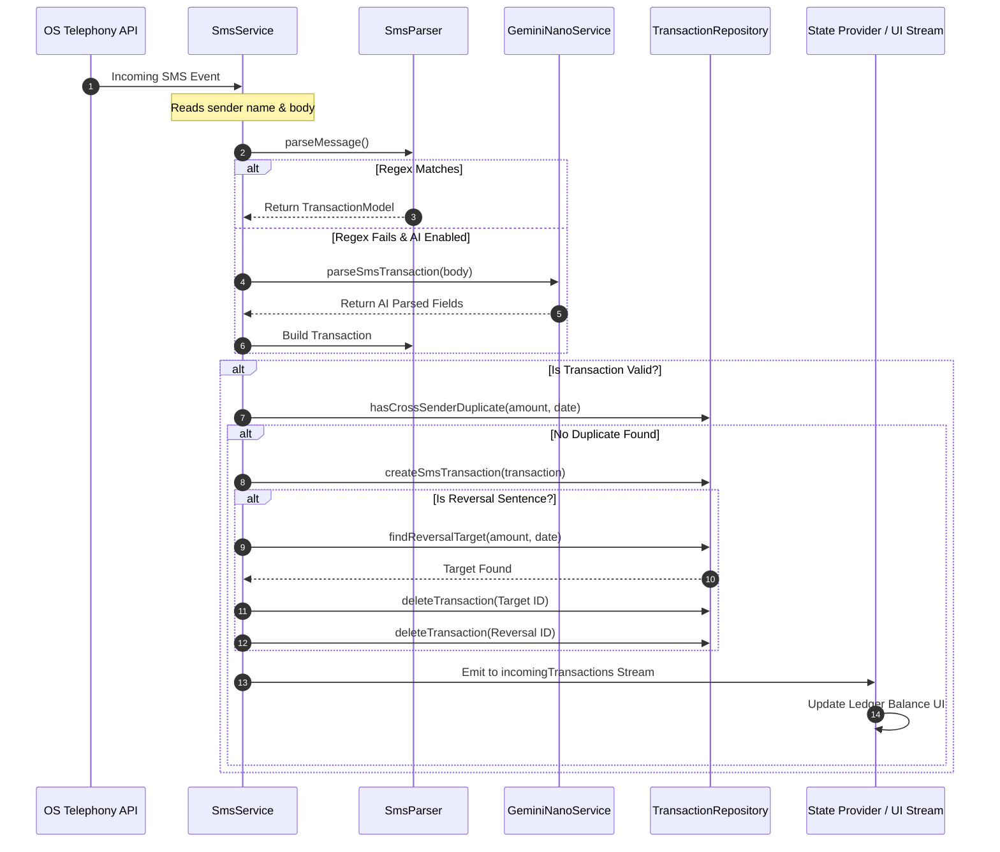

# Everything App 📝 — Developer Map & Rules

> [!IMPORTANT]
> **COMPULSORY RULES FOR AGENT EXECUTION:**
> 1. **Map Files First**: Before reading or editing files for any task, refer to the directory and module maps in this `map.md` file to target only the necessary files. Do not scan the entire workspace unless absolutely required. This is critical for token efficiency.
> 2. **Single Source of Truth**: All layout spacing, border radii, animation curves, and component tokens MUST be referenced from `AppLayout` and `AppTheme` (`lib/core/theme/`). Reusable UI primitives live in `lib/core/ui/`.
> 3. **Feature-Driven Architecture**: Code is organized into explicit domain modules under `lib/features/` (`notes`, `finances`, `health`, `settings`), with decoupled providers and repositories.
> 4. **Build and Test**: Once you implement any change, you must run the build and automated test suite (`flutter test` / `flutter analyze`) to verify the implementation.
> 5. **Haptics and Motion**: Maintain smooth haptics and Material 3 micro-animations on all user interactions.
> 6. **No Direct Commits/Pushes**: Always request explicit, real-time user permission before running `git commit` or `git push`.

---

## 🗺️ Architectural Overview & File Map

The application is built using **Flutter (Dart 3)** and follows a **Feature-Driven Repository-Service-Provider** architecture. Data is stored locally in an encrypted SQLCipher database, and state is managed reactively using `package:provider` and feature `ChangeNotifier` providers.

```
lib/
├── core/                             # Core Infrastructure & Shared Design System
│   ├── constants/
│   │   └── app_constants.dart        # Global app links and static constants
│   ├── routes/
│   │   └── app_router.dart           # Centralized route strings and M3 shared-axis transitions
│   ├── theme/
│   │   ├── app_layout.dart           # Single Source of Truth: spacing, padding, radii, motion curves
│   │   └── app_theme.dart            # Single Source of Truth: ColorSchemes & M3 Expressive typography
│   └── ui/                           # Shared Atomic UI Component Library
│       ├── app_bottom_sheet.dart     # Standardized drag-handled modal sheet
│       ├── app_card.dart             # Standardized surface card container
│       ├── app_chip.dart             # Standardized pill/chip widget (tags, categories, phases)
│       ├── app_dialog.dart           # Standardized M3 confirmation & input dialogs
│       └── frosted_sliver_app_bar.dart# Glassmorphic edge-to-edge top app bar
├── features/                         # Modular Domain Feature Bundles
│   ├── finances/                     # Financial Manager Feature Module
│   │   ├── data/
│   │   │   └── transaction_repository.dart# Transactions, categories, SMS senders CRUD & tombstones
│   │   ├── services/
│   │   │   ├── financial_export_service.dart# RFC 4180 CSV generation & safe system sharing
│   │   │   └── spending_forecast_service.dart# Unified active month run-rate forecasting & smoothing
│   │   ├── presentation/
│   │   │   ├── screens/
│   │   │   │   ├── financial_manager_screen.dart# Ledger, analytics, bulk 48h AI title refine, dual-gesture sync, RepaintBoundary chart isolation
│   │   │   │   └── transaction_editor_screen.dart# Single transaction editor with inline AI title refine
│   │   │   └── widgets/              # Feature-specific finance UI widgets
│   │   │       ├── minimal_chart_deck.dart   # 3-slide visual intelligence deck (Trajectory, Donut, Budget Pace)
│   │   │       ├── financial_ledger_tab.dart # Grouped transactions list, swipe duplicate/delete with undo
│   │   │       ├── financial_analytics_tab.dart# Centered interactive donut breakdown & ranked category spend
│   │   │       ├── burn_rate_forecast_card.dart# Daily Safe-to-Spend burn rate & month-end pacing
│   │   │       ├── recurring_rules_sheet.dart# Subscriptions & recurring rule manager sheet
│   │   │       ├── category_budgets_card.dart# Dynamic budget progress card with over-budget alerts
│   │   │       ├── top_merchants_card.dart   # Top spending destinations & merchant breakdown
│   │   │       └── financial_trash_sheet.dart# Trashed transactions manager & bulk purge
│   │   └── providers/
│   │       └── financial_manager_provider.dart# Income/expense calculations, filters, state
│   ├── health/                       # Health & Period Tracker Feature Module
│   │   ├── data/
│   │   │   └── period_repository.dart# Period logs database operations
│   │   ├── presentation/
│   │   │   ├── screens/
│   │   │   │   └── period_tracker_screen.dart# Menstrual calendar & cycle predictions UI
│   │   │   └── widgets/              # Feature-specific health presentation widgets
│   │   │       ├── cycle_phase_hero_card.dart# Moon phase visualizer & active cycle guidance
│   │   │       ├── cycle_insights_card.dart# Cycle regularity score & duration analytics
│   │   │       ├── period_log_dashboard_card.dart# Active period log manager, flow & symptoms
│   │   │       ├── period_calendar_card.dart# TableCalendar with semantic phase markers
│   │   │       └── period_log_editor_sheet.dart# Modal log editor with overlap validation
│   │   └── providers/
│   │       └── period_tracker_provider.dart# Cycle predictions, stats & symptom state
│   ├── notes/                        # Notes & WYSIWYG Editor Feature Module
│   │   ├── data/
│   │   │   └── note_repository.dart  # Note database CRUD, tagging, trash rotation
│   │   ├── presentation/
│   │   │   ├── screens/
│   │   │   │   ├── note_editor_screen.dart# WYSIWYG Quill editor, AI actions, toolbar
│   │   │   │   └── notes_list_screen.dart # Dedicated notes feed viewer
│   │   │   └── widgets/              # Editor modular presentation widgets
│   │   │       ├── note_search_replace_bar.dart# Keyboard-shortcut aware find/replace toolbar
│   │   │       ├── note_color_picker_sheet.dart# Standardized M3 palette seed picker modal
│   │   │       └── voice_dictation_pill.dart# Floating live speech-to-text recording status pill
│   │   └── providers/
│   │       └── note_editor_provider.dart# Editor state, dirty tracking, auto-save timer
│   ├── settings/                     # App Settings & Preferences Feature Module
│   │   ├── presentation/
│   │   │   └── screens/
│   │   │       ├── onboarding_screen.dart# Full-screen interactive wizard & setup choices
│   │   │       └── settings_screen.dart# App options, backup/restore, security controls
│   │   └── providers/
│   │       └── settings_provider.dart# SharedPreferences state & global app options
│   └── sync/                         # Master P2P Device Sync Feature Module
│       ├── presentation/
│       │   ├── screens/
│       │   │   └── p2p_sync_screen.dart# Master P2P control hub, status cards, peer devices
│       │   └── widgets/
│       │       ├── p2p_setup_wizard_sheet.dart# 1-tap onboarding pairing wizard
│       │       └── qr_scanner_dialog.dart# Camera QR code scanner dialog
│       ├── data/
│       │   └── p2p_pairing_model.dart# Stable peer records and multi-network endpoints
│       └── providers/
│           └── p2p_sync_provider.dart# Stable identity, pairing state, endpoint fallback & sync routing
├── data/                             # Models, Database Helpers & Legacy Compatibility Exports
│   ├── repositories/                 # Re-exports feature repositories for backward compatibility
│   ├── category_constants.dart       # Built-in transaction categories and colors
│   ├── category_definition.dart      # Category model (custom names, keywords, colors)
│   ├── database_constants.dart       # Table and column database key names
│   ├── database_helper.dart          # SQLCipher setup, KeyStore/SecureStorage integration
│   ├── database_seed.dart            # Seeds default banks and financial categories
│   ├── note_model.dart               # Note entity model
│   ├── period_log_model.dart         # Period tracker menstrual entry model
│   ├── sms_contact.dart              # SMS contact bank & custom sender rules model
│   ├── transaction_category.dart     # Category matching logic (compound priority)
│   └── transaction_model.dart        # Financial transaction record model
├── providers/                        # Global State Managers
│   └── note_provider.dart            # Note UI state provider (filtering, selection, pagination)
├── services/                         # Business Logic & Platform Integrations
│   ├── backup_service.dart           # AES-256 JSON manual and periodic auto-backups
│   ├── gemini_nano_service.dart      # Android AI Core & Gemini Nano text refining, tagging
│   ├── local_ai_service.dart         # AI Core interface definitions
│   ├── notification_service.dart     # Local notifications scheduling (period predictions)
│   ├── p2p_sync_service.dart         # Direct REST HTTP/UDP server & peer transport engine
│   ├── sms_constants.dart            # Sri Lankan bank SMS regex & sender mappings
│   ├── sms_parser.dart               # Rules-based SMS debit/credit parser
│   ├── sms_service.dart              # Telephony SMS listener, duplicates, reversals dispatcher
│   ├── sync_crypto_service.dart      # AES-256-GCM payloads encryption & pair key derivation
│   ├── sync_merge_service.dart       # Non-destructive Last-Write-Wins (LWW) bi-directional delta merge engine
│   └── update_service.dart           # Queries GitHub Release API and triggers OTA updates
├── theme/                            # Legacy Theme Compatibility Exports (Re-exports lib/core/theme/)
│   ├── app_layout.dart               # Re-exports lib/core/theme/app_layout.dart
│   └── app_theme.dart                # Re-exports lib/core/theme/app_theme.dart
├── utils/                            # App Utilities & Helpers
│   ├── app_constants.dart            # Global Constants
│   ├── app_route.dart                # Re-exports lib/core/routes/app_router.dart (AppRoute alias)
│   ├── rich_text_utils.dart          # Delta-to-Markdown & Plain Text preview helpers
│   └── widget_helper.dart            # Android widget data updater
├── widgets/                          # Reusable UI Widgets & Legacy Compatibility Exports
│   ├── home/
│   │   ├── home_app_bar.dart         # Responsive search & custom selection toolbar
│   │   └── note_view_builder.dart    # Grid/List layouts with OpenContainer transitions
│   ├── bouncing_widget.dart          # Micro-interaction feedback wrapper
│   ├── calculator_dialog.dart        # Financial inline calculations pop-up
│   ├── frosted_glass_sliver_app_bar.dart# Re-exports lib/core/ui/frosted_sliver_app_bar.dart
│   ├── settings_widgets.dart         # Helper UI segments for settings options
│   ├── sms_import_sheet.dart         # Sheet to query & parse SMS inbox history
│   └── tag_filter_bar.dart           # Multi-tag scrollable selection list
└── screens/                          # Top-Level App Screens & Legacy Compatibility Exports
    ├── app_lock_screen.dart          # PIN/Biometric App Lock session supervisor
    ├── category_management_screen.dart# Custom financial categories controller
    ├── filtered_notes_screen.dart    # Dedicated viewer for Archive and Trash notes
    ├── financial_manager_screen.dart # Re-exports lib/features/finances/presentation/screens/
    ├── home_screen.dart              # Primary multi-tab container & note feed
    ├── manage_tags_screen.dart       # Tag editor (renaming, deleting)
    ├── note_editor_screen.dart       # Re-exports lib/features/notes/presentation/screens/
    ├── period_tracker_screen.dart    # Re-exports lib/features/health/presentation/screens/
    ├── search_delegate.dart          # Real-time notes searching delegate
    ├── settings_screen.dart          # Re-exports lib/features/settings/presentation/screens/
    ├── sms_contacts_screen.dart      # SMS Sender list (block list & custom senders)
    ├── sms_rules_screen.dart         # Custom SMS pattern definition editor
    └── transaction_editor_screen.dart# Expense/Income creator/editor panel
```

---

## 🛠️ Core Modules & Feature Breakdown

### 1. Notes & WYSIWYG Editor Module (`lib/features/notes/`)
Manages note creation, organization, formatting, auto-saving, and viewing modes.
*   **Key Features**:
    *   **WYSIWYG Editing**: Uses `flutter_quill` for rich-text delta formats.
    *   **Decoupled State**: `NoteEditorProvider` manages dirty state tracking, auto-save timers (2s), and content mutations.
    *   **Lossless Storage**: Stored in SQLite as Delta JSON arrays, falling back to raw Markdown for legacy notes via `RichTextUtils`.
    *   **Smart Preview**: Renders checklist states (☐/☑) and formats up to 6 lines of plain text directly on home note cards.
    *   **Trash Auto-Purge**: Deleted notes are soft-deleted and automatically purged after 7 days via `clearOldTrash()`.
*   **Key Files**:
    *   Feature Screen: `lib/features/notes/presentation/screens/note_editor_screen.dart`
    *   State Manager: `lib/features/notes/providers/note_editor_provider.dart`
    *   Database CRUD: `lib/features/notes/data/note_repository.dart`
    *   Entity Model: `lib/data/note_model.dart`
    *   Format Conversions: `lib/utils/rich_text_utils.dart`

### 2. Financial Manager Module (`lib/features/finances/`)
A private ledger to track expenses, earnings, and financial habits.
*   **Key Features**:
    *   **Decoupled State**: `FinancialManagerProvider` manages balance calculations, range filters, and transactions reactively.
    *   **Curated & Custom Currencies**: `CurrencyInfo` metadata (`lib/utils/app_constants.dart`) provides authentic currency symbols (`Rs.`, `₹`, `$`, `€`, `£`, `¥`, `د.إ`, `﷼`, `C$`, `A$`, `S$`, `RM`, `NZ$`, `CHF`) and supports custom currency codes.
    *   **SMS Import Rules & Test Sandbox**: Interactive sandbox in `SmsRulesScreen` with clipboard paste and live parsing feedback.
    *   **One-Tap Category Learning**: Contextual suggestion chip in `TransactionEditorScreen` with stopword protection to train custom keywords into `CategoryDefinition`.
    *   **Hardware-Aware AI Gating (`isAiActive`)**: AI refine options and sparkle icons are strictly gated by `settings.isAiActive` (`_useOnDeviceAi && _isDeviceAiSupported`) so devices without Gemini Nano/AICore hardware hide dead controls.
    *   **Tabular Figures & Typography**: All financial ledgers, numbers, and balance cards use `Inter` with tabular figures (`fontFeatures: [FontFeature.tabularFigures()]`).
    *   **Inline Calculator**: Accessible during expense creation inside `CalculatorDialog`.
    *   **Trend Visuals & Regression**: Exponentially-weighted linear regression with Huber-style outlier dampening.
    *   **Double-Level Categorization**: Auto-categorization matches transaction descriptions using keyword rules.
*   **Key Files**:
    *   Main UI: `lib/features/finances/presentation/screens/financial_manager_screen.dart`
    *   Rules & Test Sandbox: `lib/features/finances/presentation/screens/sms_rules_screen.dart`
    *   State Manager: `lib/features/finances/providers/financial_manager_provider.dart`
    *   Database CRUD: `lib/features/finances/data/transaction_repository.dart`
    *   Editor Panel: `lib/features/finances/presentation/screens/transaction_editor_screen.dart`
    *   Custom Categories UI: `lib/screens/category_management_screen.dart`

### 3. Health & Period Tracker Module (`lib/features/health/`)
A fully offline, privacy-first menstrual cycle tracker.
*   **Key Features**:
    *   **Prediction Algorithm**: Computes average cycle length based on the last 3 to 7 logs, dynamically filtering out outliers (unrealistic cycles $<15$ days or $>60$ days).
    *   **Ovulation Calculator**: Predicts ovulation dates exactly 14 days prior to the estimated start date of the next period.
    *   **Semantic Phase Colors**: Phase colors resolved at build time via `AppSemanticColors` (`ThemeExtension`).
    *   **Discreet Notifications**: Schedules upcoming cycle alerts locally using customizable discreet text (e.g. `"Check the app"`).
*   **Key Files**:
    *   UI Screen: `lib/features/health/presentation/screens/period_tracker_screen.dart`
    *   Database Operations: `lib/features/health/data/period_repository.dart`
    *   Cycle Predictions Logic: `lib/services/period_prediction_service.dart`
    *   Log Entity: `lib/data/period_log_model.dart`

### 4. Settings & App Preferences Module (`lib/features/settings/`)
Consolidates global app configuration, security timeouts, and data backups.
*   **Key Features**:
    *   **Global Provider**: `SettingsProvider` handles dark/light theme modes, dynamic colors, currency preferences, custom rules, and category budgets.
    *   **Backup & Recovery**: Encrypted JSON backups via `BackupService`. Excludes sensitive biometric settings to prevent override via untrusted files.
*   **Key Files**:
    *   UI Screen: `lib/features/settings/presentation/screens/settings_screen.dart`
    *   State Manager: `lib/features/settings/providers/settings_provider.dart`

### 5. Core Design System & UI Components (`lib/core/`)
*   **Single Source of Truth**: All layout spacing, border radii, animation curves, and colors are defined in `AppLayout` and `AppTheme` (`lib/core/theme/`).
*   **Atomic UI Library**: Reusable UI components in `lib/core/ui/`:
    *   `AppCard`: Standardized card container with single-source-of-truth surface fills and touch feedback.
    *   `AppBottomSheet`: Standardized modal sheet container with drag handle and width constraints.
    *   `AppChip`: Standardized pill/chip widget for tags, categories, phase badges, and filters.
    *   `AppDialog`: Standardized responsive confirmation and input dialogs.
    *   `FrostedGlassSliverAppBar`: Glassmorphic top bar with edge-to-edge blur.

### 6. Master P2P Device Sync (`lib/features/sync/`)
*   **Stable Peer Identity**: `P2pSyncService` persists a UUID per installation. `PairedDevice` records are deduplicated only by that UUID, not by dynamic DHCP IP addresses or pair codes.
*   **Dynamic Wi-Fi Endpoints**: A peer can keep several `DeviceEndpoint` records. The provider migrates legacy single-IP pairing data and tries the most recently successful endpoint before fallbacks.
*   **QR Handshake**: Versioned QR payloads provide the host ID, friendly name, local IP and port; pairing is persisted only after the host acknowledgement succeeds. Device names may be changed after pairing.

---

## 🗄️ Database Schema Map

All tables are defined and created inside `database_helper.dart`.



---

## 🔄 Core Workflows & Integrations

### SMS Transaction Auto-Import Workflow



---

## 🚀 Deployment & CI/CD Pipeline

*   **Version Automation (`deploy.sh`)**:
    *   Run the script: `./deploy.sh 1.34.0`
    *   **Version Code Generation**: Computes numeric build code:
        $$\text{buildNumber} = (\text{major} \times 10000) + (\text{minor} \times 100) + \text{patch}$$
    *   **YAML Updates**: Replaces version in `pubspec.yaml`.
    *   **Automated Tagging**: Commits changes, tags release, and pushes tag to GitHub, triggering CI/CD.
