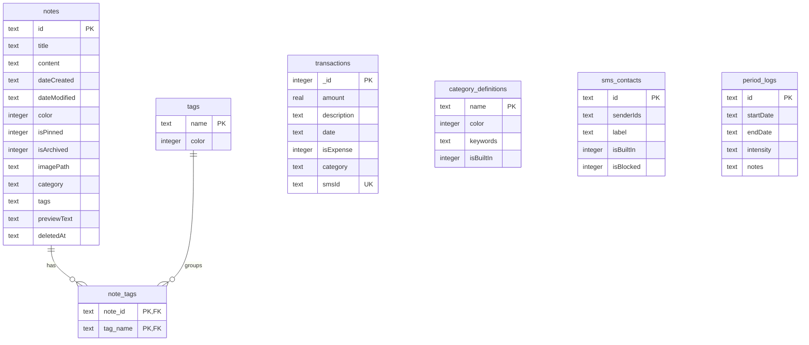
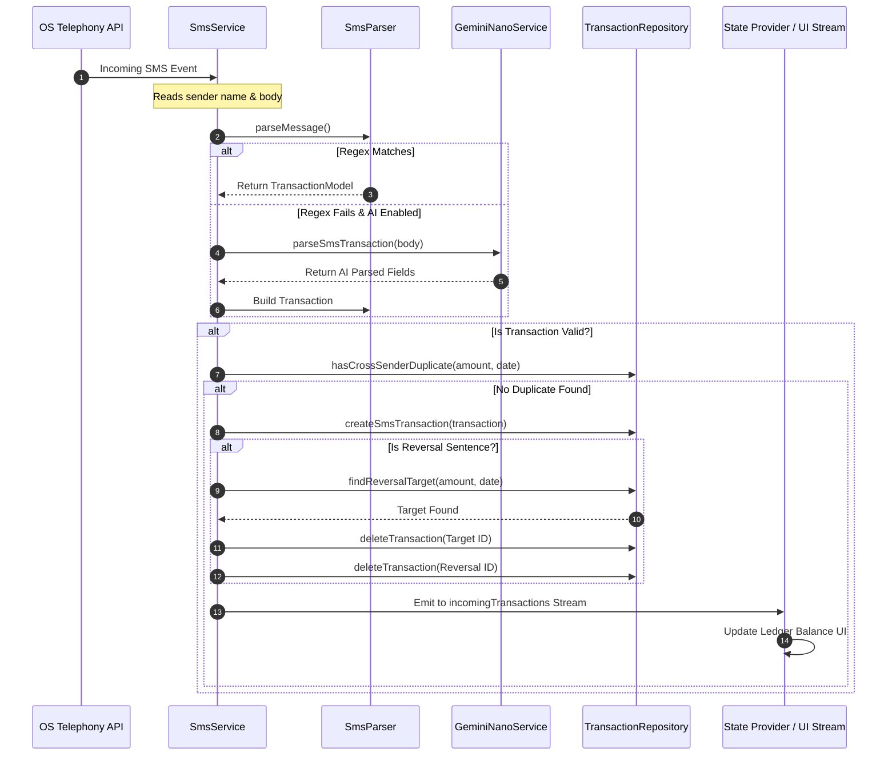
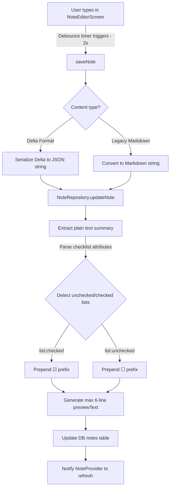

# Note Book 📝 — Developer Map & Knowledge Base

This document serves as a comprehensive developer map and token-saving knowledge base for the **Note Book** application. It explicitly outlines the features, their architectural implementation, file responsibilities, database schemas, and integration flows.

Use this file to quickly feed context to AI coding assistants without needing to scan the entire codebase.

---

## 🗺️ Architectural Overview & File Map

The application is built using **Flutter (Dart 3)** and follows a **Repository-Service-Provider** architecture. Data is stored locally in an encrypted SQLCipher database, and state is managed globally using `package:provider`.

```
lib/
├── data/                             # Data Layer (Models, Repositories, DB Helpers)
│   ├── repositories/
│   │   ├── note_repository.dart       # Note database CRUD, tagging, and trash rotation
│   │   ├── period_repository.dart     # Period logs database operations
│   │   └── transaction_repository.dart# Transactions, categories, SMS senders CRUD
│   ├── category_constants.dart       # Built-in transaction categories and colors
│   ├── category_definition.dart      # Category model (custom names, keywords, colors)
│   ├── database_constants.dart       # Table and column database key names
│   ├── database_helper.dart          # SQLCipher setup, KeyStore/SecureStorage integration
│   ├── database_seed.dart            # Seeds default banks and financial categories
│   ├── note_model.dart               # Note entity model
│   ├── period_log_model.dart         # Period tracker menstrual entry model
│   ├── settings_provider.dart        # SharedPreferences state & global app options
│   ├── sms_contact.dart              # SMS contact bank & custom sender rules model
│   ├── transaction_category.dart     # Category matching logic (compound priority)
│   └── transaction_model.dart        # Financial transaction record model
├── providers/                        # State Management / View Models
│   └── note_provider.dart            # Note UI state provider (filtering, selection, pagination)
├── services/                         # Business Logic & Platform Integrations
│   ├── backup_service.dart           # AES-256 JSON manual and periodic auto-backups
│   ├── ffmpeg_install_service.dart   # Downloads and uninstalls FFmpeg binaries
│   ├── ffmpeg_service.dart           # FFmpeg video/image/audio compression engine
│   ├── gemini_nano_service.dart      # Android AI Core & Gemini Nano text refining, tagging
│   ├── local_ai_service.dart         # AI Core interface definitions
│   ├── notification_service.dart     # Local notifications scheduling (period predictions)
│   ├── sms_constants.dart            # Sri Lankan bank SMS regex & sender mappings
│   ├── sms_parser.dart               # Rules-based SMS debit/credit parser
│   └── sms_service.dart              # Telephony SMS listener, duplicates, reversals dispatcher
├── theme/                            # Presentation Layer Design Tokens
│   ├── app_layout.dart               # Spacing, padding, and corner radius tokens
│   └── app_theme.dart                # Light/Dark ColorSchemes & Material You support
├── utils/                            # App Utilities
│   ├── app_constants.dart            # Global Constants
│   └── rich_text_utils.dart          # Delta-to-Markdown & Plain Text preview helpers
├── widgets/                          # Reusable UI Components
│   ├── home/
│   │   ├── home_app_bar.dart         # Responsive search & custom selection toolbar
│   │   └── note_view_builder.dart    # Grid/List layouts with OpenContainer transitions
│   ├── bouncing_widget.dart          # Micro-interaction feedback wrapper
│   ├── calculator_dialog.dart        # Financial inline calculations pop-up
│   ├── settings_widgets.dart         # Helper UI segments for settings options
│   ├── sms_import_sheet.dart         # Sheet to query & parse SMS inbox history
│   └── tag_filter_bar.dart           # Multi-tag scrollable selection list
└── screens/                          # Complete Application Screens
    ├── app_lock_screen.dart          # PIN/Biometric App Lock session supervisor
    ├── category_management_screen.dart# Custom financial categories controller
    ├── file_converter_screen.dart    # Video & Image compression UI presets
    ├── filtered_notes_screen.dart    # Dedicated viewer for Archive and Trash notes
    ├── financial_manager_screen.dart # Financial dashboard, graphs, and transaction search
    ├── home_screen.dart              # Primary multi-tab container & note feed
    ├── manage_tags_screen.dart       # Tag editor (renaming, deleting)
    ├── note_editor_screen.dart       # WYSIWYG note editor, AI actions, tag selectors
    ├── period_tracker_screen.dart    # Menstrual calendar & future prediction logging
    ├── search_delegate.dart          # Real-time notes searching delegate
    ├── sms_contacts_screen.dart      # SMS Sender list (block list & custom senders)
    ├── sms_rules_screen.dart         # Custom SMS pattern definition editor
    └── transaction_editor_screen.dart# Expense/Income creator/editor panel
```

---

## 🛠️ Core Modules & Feature Breakdown

### 1. Notes & WYSIWYG Editor Module

Manages note creation, organization, formatting, and viewing modes.

*   **Key Features**:
    *   **WYSIWYG Editing**: Uses `flutter_quill` for rich-text delta formats, supporting headers, blockquotes, lists, checklists, and images.
    *   **Lossless Storage**: Notes are stored in SQLite as Delta JSON arrays, falling back to raw Markdown for legacy notes via [RichTextUtils](file:///Users/saadhjawwadh/Documents/Code/Note%20taking/lib/utils/rich_text_utils.dart).
    *   **Smart Preview**: Renders checklist states (☐/☑) and formats up to 6 lines of plain text directly on home note cards.
    *   **Dynamic Theme Matching**: The note's background color automatically adapts to its active tags, pulling from an 18-shade Material color scheme.
    *   **Multi-View Layouts**: Home supports masonry grid, uniform grid, and list views, powered by `package:animations` (`OpenContainer` transitions) for premium transitions.
    *   **Bulk Operations**: Selection mode allows tagging, archiving, or deleting multiple notes at once.
    *   **Trash Auto-Purge**: Deleted notes are soft-deleted (`deletedAt` timestamp populated) and automatically purged after 7 days via [NoteRepository.clearOldTrash()](file:///Users/saadhjawwadh/Documents/Code/Note%20taking/lib/data/repositories/note_repository.dart).
*   **Key Files**:
    *   UI Screen: [note_editor_screen.dart](file:///Users/saadhjawwadh/Documents/Code/Note%20taking/lib/screens/note_editor_screen.dart)
    *   State Model: [note_model.dart](file:///Users/saadhjawwadh/Documents/Code/Note%20taking/lib/data/note_model.dart)
    *   View Model / State Manager: [note_provider.dart](file:///Users/saadhjawwadh/Documents/Code/Note%20taking/lib/providers/note_provider.dart)
    *   Database CRUD: [note_repository.dart](file:///Users/saadhjawwadh/Documents/Code/Note%20taking/lib/data/repositories/note_repository.dart)
    *   Format Conversions: [rich_text_utils.dart](file:///Users/saadhjawwadh/Documents/Code/Note%20taking/lib/utils/rich_text_utils.dart)

---

### 2. Financial Manager Module

A private ledger to track expenses, earnings, and financial habits.

*   **Key Features**:
    *   **Inline Calculator**: Accessible during expense creation, supporting simple operators (+, -, \*, /) directly inside [CalculatorDialog](file:///Users/saadhjawwadh/Documents/Code/Note%20taking/lib/widgets/calculator_dialog.dart).
    *   **Trend Visuals**: Includes a 6-month transaction trends chart separating income vs expenses (excluding Sentinel reversal flags).
    *   **Real-time Search**: Search transactions by category, custom keywords, or description.
    *   **Double-Level Categorization**: Auto-categorization matches transaction descriptions to categories using keyword rules. Compound keywords (e.g. `"PickMe Food"` → `Food & Dining`) take precedence over single keywords (e.g. `"PickMe"` → `Transport`) via [TransactionCategory.fromDescriptionCached()](file:///Users/saadhjawwadh/Documents/Code/Note%20taking/lib/data/transaction_category.dart).
    *   **Custom Category Manager**: Users can declare custom categories, associate colors, and define comma-separated keywords for automated parsing rules.
*   **Key Files**:
    *   Main UI: [financial_manager_screen.dart](file:///Users/saadhjawwadh/Documents/Code/Note%20taking/lib/screens/financial_manager_screen.dart)
    *   Editor Panel: [transaction_editor_screen.dart](file:///Users/saadhjawwadh/Documents/Code/Note%20taking/lib/screens/transaction_editor_screen.dart)
    *   Custom Categories UI: [category_management_screen.dart](file:///Users/saadhjawwadh/Documents/Code/Note%20taking/lib/screens/category_management_screen.dart)
    *   State Model: [transaction_model.dart](file:///Users/saadhjawwadh/Documents/Code/Note%20taking/lib/data/transaction_model.dart) & [category_definition.dart](file:///Users/saadhjawwadh/Documents/Code/Note%20taking/lib/data/category_definition.dart)
    *   Database Operations: [transaction_repository.dart](file:///Users/saadhjawwadh/Documents/Code/Note%20taking/lib/data/repositories/transaction_repository.dart)

---

### 3. SMS Auto-Import Service

Provides background and manual parsing of incoming bank transaction SMS messages (optimized for Sri Lankan banks).

*   **Key Features**:
    *   **Background Telephony**: Listens to incoming messages in real-time, executing background parsing even when the app is suspended.
    *   **Smart Parsing Rules**:
        *   Skips promotional alerts, payment reminders, cancelled transactions, and duplicate warnings.
        *   Detects deposit, withdrawal, fund transfer, purchase, and installment events using Regex.
        *   **Cross-Sender Deduplication**: Skips logs if another identical transaction occurred within a $\pm5$ minute window (e.g. bank app notification + SMS fired together).
        *   **Automatic Reversals**: Refund or reversal messages delete the matching target transaction from the database within a 7-day retrospective window and discard the reversal record itself to keep metrics accurate.
    *   **SMS Contacts**: Senders can be marked as blocked or registered as custom sender groups (e.g., KOKO, FriMi).
    *   **Retroactive Inbox Scanner**: Allows users to scan their SMS inbox historically by selecting a "Sync From" date.
*   **Key Files**:
    *   SMS Background Handler & Streams: [sms_service.dart](file:///Users/saadhjawwadh/Documents/Code/Note%20taking/lib/services/sms_service.dart)
    *   SMS Text Regex Rules: [sms_constants.dart](file:///Users/saadhjawwadh/Documents/Code/Note%20taking/lib/services/sms_constants.dart)
    *   Regex Parser: [sms_parser.dart](file:///Users/saadhjawwadh/Documents/Code/Note%20taking/lib/services/sms_parser.dart)
    *   Inbox Sync UI: [sms_import_sheet.dart](file:///Users/saadhjawwadh/Documents/Code/Note%20taking/lib/widgets/sms_import_sheet.dart)
    *   SMS Sender UI: [sms_contacts_screen.dart](file:///Users/saadhjawwadh/Documents/Code/Note%20taking/lib/screens/sms_contacts_screen.dart)
    *   SMS Custom Rules: [sms_rules_screen.dart](file:///Users/saadhjawwadh/Documents/Code/Note%20taking/lib/screens/sms_rules_screen.dart)

---

### 4. Period Tracker Module

A fully offline, privacy-first menstrual cycle tracker.

*   **Key Features**:
    *   **Prediction Algorithm**: Computes average cycle length based on the last 3 to 7 logs, dynamically filtering out outliers (unrealistic cycles $<15$ days or $>60$ days) to prevent prediction skew.
    *   **Ovulation Calculator**: Predicts ovulation dates exactly 14 days prior to the estimated start date of the next period (Luteal phase assumption).
    *   **Logs & Symptoms**: Tracks flow intensity (Spotting, Light, Medium, Heavy) and custom notes.
    *   **Discreet Notifications**: Schedules upcoming cycle alerts locally. To ensure absolute privacy, notifications use customizable discreet text (e.g. `"Check the app"`).
*   **Key Files**:
    *   UI Screen: [period_tracker_screen.dart](file:///Users/saadhjawwadh/Documents/Code/Note%20taking/lib/screens/period_tracker_screen.dart)
    *   Log Entity: [period_log_model.dart](file:///Users/saadhjawwadh/Documents/Code/Note%20taking/lib/data/period_log_model.dart)
    *   Cycle Predictions Logic: [period_prediction_service.dart](file:///Users/saadhjawwadh/Documents/Code/Note%20taking/lib/services/period_prediction_service.dart)
    *   Database Operations: [period_repository.dart](file:///Users/saadhjawwadh/Documents/Code/Note%20taking/lib/data/repositories/period_repository.dart)

---

### 5. On-Device AI Integration (Gemini Nano)

Leverages native NPUs and Android's AI Core for offline, privacy-safe text generation and parsing.

*   **Key Features**:
    *   **Smart Tagging**: Suggests 1 to 3 relevant tags based strictly on existing tag collections in the editor.
    *   **Selection Refinement**: Supports highlighting text inside the editor and refining it via 5 modes: *Polish*, *Shorten*, *Expand*, *Professional*, and *Casual*.
    *   **Note Summarizer**: Auto-summarizes text using bullet points. Adjusts summary language to Tamil if Tamil text is detected; otherwise, defaults to English.
    *   **AI SMS Parsing**: Serves as a fallback for the regular expressions. Extracts merchant name, category, transaction amount, and direction (expense vs income) from raw bank texts, formatting output as clean JSON.
    *   **Description Refiner**: Refines long, messy raw bank SMS descriptions (containing reference IDs, date info, card numbers) into clean merchant titles (e.g., `"Purchase at Keells Super..."` → `"Keells Super"`).
*   **Key Files**:
    *   AI Core Controller: [gemini_nano_service.dart](file:///Users/saadhjawwadh/Documents/Code/Note%20taking/lib/services/gemini_nano_service.dart)
    *   Abstract Interface: [local_ai_service.dart](file:///Users/saadhjawwadh/Documents/Code/Note%20taking/lib/services/local_ai_service.dart)

---

### 6. Privacy, Security & Database

Ensures all private user data remains strictly local and secure.

*   **Key Features**:
    *   **SQLCipher Encryption**: The SQLite database (`notes.db`) is encrypted at rest using 256-bit AES via SQLCipher.
    *   **Hardware KeyStore Protection**: The 256-bit database key is generated randomly, stored securely inside the Android KeyStore/iOS Keychain via `FlutterSecureStorage`, and backed up locally in SharedPreferences.
    *   **App Lock**: Employs `local_auth` to lock screens on app resume or timeout. Users can authenticate using Fingerprint, FaceID, or device PIN/Pattern.
    *   **Auto-Lock Timeout**: Automatically locks the app if it remains in the background longer than the user's custom timeout setting (in seconds).
    *   **Intent Bypass Security**: Temporarily suspends app lock checking when the app is launched via native Android/iOS file share targets to avoid getting stuck during system transitions.
*   **Key Files**:
    *   Lock Controller: [app_lock_screen.dart](file:///Users/saadhjawwadh/Documents/Code/Note%20taking/lib/screens/app_lock_screen.dart)
    *   Database Engine: [database_helper.dart](file:///Users/saadhjawwadh/Documents/Code/Note%20taking/lib/data/database_helper.dart)
    *   Settings Manager: [settings_provider.dart](file:///Users/saadhjawwadh/Documents/Code/Note%20taking/lib/data/settings_provider.dart)

---

### 7. Backup & Recovery System

Enables exporting and restoring data securely across devices.

*   **Key Features**:
    *   **Encrypted JSON**: Exports Notes, Tags, Note Tags, Transactions, Custom Categories, Senders list, Period Logs, and Settings in a clean JSON format.
    *   **Restore Guardrails**: Security-sensitive variables (e.g. `appLockEnabled`, `useBiometrics`) are omitted during restores to prevent locking bypasses.
    *   **Auto-Backups**: Uses `Workmanager` to schedule background backups (daily, weekly, or monthly).
    *   **Backup Rotation**: Keeps only the 5 most recent automatic backups, automatically deleting older files.
    *   **Cloud Exclusions**: Cloud backups explicitly exclude database encryption keys to ensure your data remains secure if your cloud account is compromised.
*   **Key Files**:
    *   Service Methods: [backup_service.dart](file:///Users/saadhjawwadh/Documents/Code/Note%20taking/lib/services/backup_service.dart)
    *   Schedule Configuration: [settings_provider.dart](file:///Users/saadhjawwadh/Documents/Code/Note%20taking/lib/data/settings_provider.dart)

---

### 8. File & Media Converter (Fiber Converter)

A background utility for media file compression and format conversion.

*   **Key Features**:
    *   **Dual Mode Execution**:
        *   **Lite Mode**: Leverages native, lightweight platform APIs for quick conversions.
        *   **FFmpeg Mode**: Prompts users to download local FFmpeg engine binaries (approx. 45MB) to execute high-quality conversions.
    *   **Presets**: Custom video format configurations (mp4, mkv, gif) and image formats (jpg, png, webp).
    *   **Resolution Limits**: Supports downscaling to 1080p, 720p, or 480p.
    *   **Metadata Conservation**: Option to preserve or strip EXIF metadata for privacy.
    *   **Background Sharing Target**: Registers the app as a system-wide share target. Media shared from the system gallery automatically opens the Converter screen.
*   **Key Files**:
    *   UI Panel: [file_converter_screen.dart](file:///Users/saadhjawwadh/Documents/Code/Note%20taking/lib/screens/file_converter_screen.dart)
    *   FFmpeg Controller: [ffmpeg_service.dart](file:///Users/saadhjawwadh/Documents/Code/Note%20taking/lib/services/ffmpeg_service.dart)
    *   Binary Downloader: [ffmpeg_install_service.dart](file:///Users/saadhjawwadh/Documents/Code/Note%20taking/lib/services/ffmpeg_install_service.dart)

---

## 🗄️ Database Schema Map

All tables are defined and created inside [database_helper.dart](file:///Users/saadhjawwadh/Documents/Code/Note%20taking/lib/data/database_helper.dart).



### Table Definitions & Constraints

1.  **`notes`**:
    *   Stores WYSIWYG note data.
    *   `content` holds rich-text delta JSON strings.
    *   `deletedAt` contains the soft-delete timestamp.
2.  **`tags`**:
    *   Holds user-defined tags.
    *   `color` stores 32-bit ARGB tag color values.
3.  **`note_tags`**:
    *   Many-to-many relationship linking `notes` and `tags`.
    *   `note_id` contains a cascade delete foreign key referencing `notes.id`.
4.  **`transactions`**:
    *   Holds financial ledger records.
    *   `smsId` has a unique constraint to prevent duplicate imports (`idx_transactions_smsId`).
5.  **`category_definitions`**:
    *   Maps financial categories, colors, and keywords.
    *   `keywords` is stored as a serialized JSON string array.
6.  **`sms_contacts`**:
    *   Registers SMS senders.
    *   `senderIds` holds bank shortcode filters (e.g. `['COMBANK', 'CBSL']`) as serialized JSON.
7.  **`period_logs`**:
    *   Menstrual calendar logs.
    *   `intensity` tracks flow volume: Spotting, Light, Medium, or Heavy.

---

## 🔄 Core Workflows & Integrations

### SMS Transaction Auto-Import Workflow

How bank SMS alerts are processed from receipt to database insertion:



---

### Note Auto-Save & Rendering Flow

How changes in the note editor are saved and optimized for screen rendering:



---

## 🚀 Deployment & CI/CD Pipeline

The application incorporates automated scripts to package and push code.

*   **Version Automation (`deploy.sh`)**:
    *   Run the script: `./deploy.sh 1.17.0`
    *   **Version Code Generation**: The script parses the version number (`major.minor.patch`) and computes a numeric build code:
        $$\text{buildNumber} = (\text{major} \times 10000) + (\text{minor} \times 100) + \text{patch}$$
    *   **YAML Updates**: Replaces the version details in `pubspec.yaml` (e.g. `version: 1.17.0+11700`).
    *   **Automated Tagging**: Commits changes, deletes any conflicting local/remote tags, creates an annotated release tag (e.g. `v1.17.0`), and pushes the commit and tags to GitHub.
    *   **CI Trigger**: Pushing the tag triggers the GitHub Action pipeline to build release binaries.
